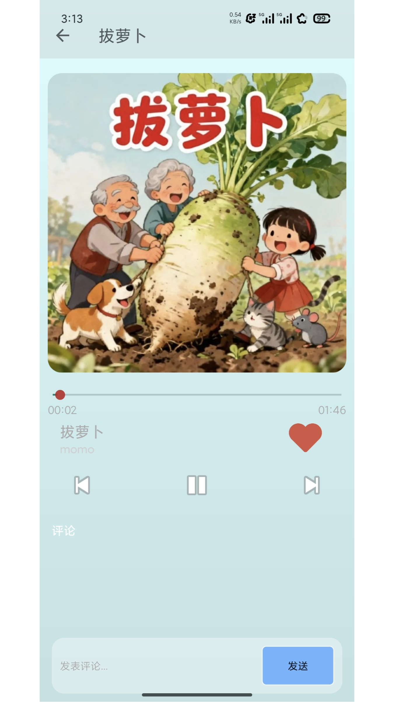
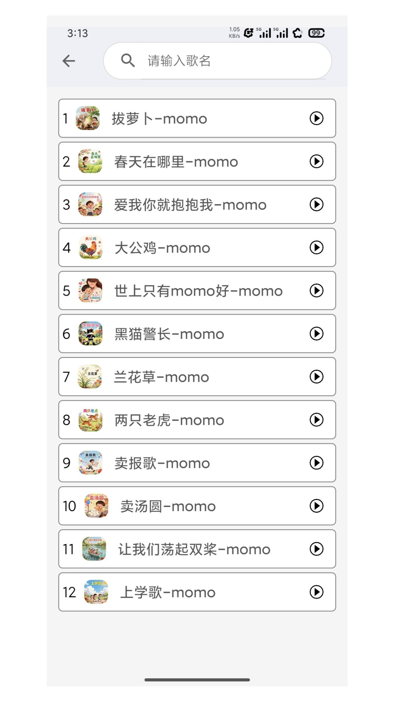
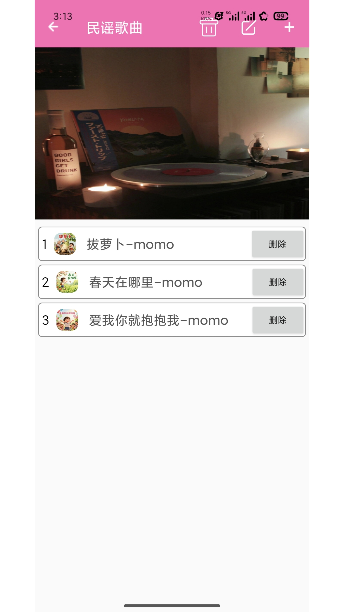

# 🎵 BabySongs - 儿歌播放器

<div align="center">


一款专为儿童设计的简洁、易用的儿歌播放器

[功能特性](#-功能特性) • [快速开始](#-快速开始) • [截图预览](#-截图预览) • [技术栈](#️-技术栈) • [贡献指南](#-贡献指南)

</div>

---

## 📖 项目简介

**BabySongs** 是一款专为儿童和家长设计的 Android 儿歌播放器应用。应用内置精选儿歌，界面简洁友好，操作简单直观，让孩子们能够轻松欣赏经典儿歌。

### ✨ 为什么选择 BabySongs？

- 🎨 **界面友好** - 采用渐变色彩设计，符合儿童审美
- 🎵 **精选曲库** - 内置经典儿歌，无需网络即可播放
- 📱 **简单易用** - 大按钮设计，儿童也能轻松操作
- 🔒 **绿色安全** - 无广告、无内购，纯净播放体验
- 💾 **无需权限** - 使用应用私有存储，无需额外权限

---

## 🎯 功能特性

### 核心功能

- ✅ **儿歌播放** - 支持播放、暂停、上一首、下一首
- ✅ **播放列表** - 自动循环播放，支持播放全部
- ✅ **进度控制** - 可拖动进度条快进/快退
- ✅ **后台播放** - 支持切换到后台继续播放
- ✅ **收藏功能** - 收藏喜欢的儿歌，快速访问
- ✅ **搜索功能** - 快速查找想听的儿歌
- ✅ **播放详情** - 显示歌曲封面、歌词、歌手信息

### 特色功能

- 🎼 **曲风分类** - 支持按曲风（流行、民谣、古典等）筛选
- 💬 **讨论区** - 家长可以分享育儿心得和儿歌推荐
- 📊 **播放统计** - 记录听歌时长和播放次数
- 🌈 **主题色彩** - 根据歌曲封面自动提取主题色

---

## 📦 快速开始

### 环境要求

- **Android Studio** Arctic Fox (2020.3.1) 或更高版本
- **JDK** 11 或更高版本
- **Android SDK** API 24+ (Android 7.0+)
- **Gradle** 7.0+

### 克隆项目

```bash
git clone https://github.com/ok406lhq/BabySongs.git
cd BabySongs
```

### 导入项目

1. 打开 Android Studio
2. 选择 `File` → `Open`
3. 选择克隆的项目目录
4. 等待 Gradle 同步完成

### 运行应用

1. 连接 Android 设备或启动模拟器
2. 点击 `Run` 按钮 (或按 `Shift + F10`)
3. 选择目标设备并运行

### 构建 APK

```bash
# Debug 版本
./gradlew assembleDebug

# Release 版本
./gradlew assembleRelease
```

生成的 APK 位于：`app/build/outputs/apk/`

---

## 📸 截图预览

<div align="center">

### 主要功能

   


</div>

---

## 🎵 内置儿歌列表

| 歌曲名称 | 类型 | 时长 |
|---------|------|------|
| 拔萝卜 | 经典儿歌 | 2:30 |
| 春天在哪里 | 季节儿歌 | 2:15 |
| 爱我你就抱抱我 | 亲子儿歌 | 3:00 |
| 大公鸡 | 动物儿歌 | 1:45 |
| 世上只有妈妈好 | 经典儿歌 | 2:50 |
| 黑猫警长 | 动画儿歌 | 2:20 |
| 兰花草 | 民谣儿歌 | 3:10 |
| 两只老虎 | 经典儿歌 | 1:30 |
| 卖报歌 | 经典儿歌 | 2:00 |
| 卖汤圆 | 民俗儿歌 | 2:40 |
| 让我们荡起双桨 | 经典儿歌 | 3:30 |
| 上学歌 | 校园儿歌 | 2:10 |

> 持续更新中... 欢迎贡献更多优质儿歌资源！

---

## 🛠️ 技术栈

### 核心框架

- **开发语言**: Java
- **最低支持**: Android 7.0 (API 24)
- **目标版本**: Android 13 (API 33)

### 主要依赖库

| 库名称 | 版本 | 用途 |
|--------|------|------|
| ExoPlayer | 2.18.1 | 音频播放引擎 |
| Glide | 4.14.2 | 图片加载和缓存 |
| EventBus | 3.3.1 | 组件间通信 |
| FastJSON | 1.2.83 | JSON 解析 |
| RecyclerView | 1.3.0 | 列表展示 |
| CardView | 1.0.0 | 卡片布局 |
| Material Components | 1.9.0 | Material Design UI |

### 架构设计

```
app/
├── src/main/
│   ├── java/com/cool/music/
│   │   ├── activity/          # Activity 页面
│   │   │   ├── user/          # 用户端页面
│   │   │   │   └── fragment/  # Fragment 组件
│   │   │   └── man/           # 管理端页面
│   │   ├── adapter/           # RecyclerView 适配器
│   │   ├── bean/              # 数据模型类
│   │   ├── dao/               # 数据访问层
│   │   └── until/             # 工具类
│   ├── res/
│   │   ├── layout/            # 布局文件
│   │   ├── drawable/          # 图片资源
│   │   ├── raw/               # 音频文件
│   │   └── values/            # 配置文件
│   └── AndroidManifest.xml    # 应用配置
└── build.gradle               # 构建配置
```

---

## 🔧 核心功能实现

### 1. 单例播放器管理

```java
public class MusicPlayerManager {
    private static MusicPlayerManager instance;
    private ExoPlayer player;
    
    public static synchronized MusicPlayerManager getInstance() {
        if (instance == null) {
            instance = new MusicPlayerManager();
        }
        return instance;
    }
    
    public ExoPlayer getPlayer(Context context) {
        if (player == null) {
            player = new ExoPlayer.Builder(context.getApplicationContext()).build();
        }
        return player;
    }
}
```

### 2. 自动续播功能

```java
private Player.Listener playerListener = new Player.Listener() {
    @Override
    public void onPlaybackStateChanged(int playbackState) {
        if (playbackState == Player.STATE_ENDED) {
            playNextMusic(); // 自动播放下一首
        }
    }
};
```

### 3. 数据库管理

使用 SQLite 本地数据库存储：
- 用户信息
- 歌曲列表
- 播放历史
- 收藏记录
- 讨论帖子

---

## 📱 适配说明

### 刘海屏适配

```java
private void applyNotchAdaptation(View rootView) {
    ViewCompat.setOnApplyWindowInsetsListener(rootView, (v, insets) -> {
        Insets systemBars = insets.getInsets(WindowInsetsCompat.Type.systemBars());
        Insets displayCutout = insets.getInsets(WindowInsetsCompat.Type.displayCutout());
        
        int topInset = Math.max(systemBars.top, displayCutout.top);
        v.setPadding(v.getPaddingLeft() + leftInset, v.getPaddingTop() + topInset, ...);
        
        return WindowInsetsCompat.CONSUMED;
    });
}
```

### 存储权限优化

使用应用私有存储，无需申请外部存储权限：

```java
context.getExternalFilesDir(Environment.DIRECTORY_MUSIC)
```

---

## 🎨 UI 设计

### 配色方案

| 颜色名称 | 色值 | 用途 |
|---------|------|------|
| 主色调 - 粉红 | `#FF6B9D` | 按钮、强调色 |
| 主色调 - 紫色 | `#C874E7` | 渐变背景 |
| 主色调 - 蓝紫 | `#8B7EF8` | 渐变背景 |
| 背景色 | `#F5F5F5` | 页面背景 |
| 卡片背景 | `#FFFFFF` | 列表卡片 |
| 深色文字 | `#333333` | 标题文字 |
| 浅色文字 | `#999999` | 提示文字 |

### 设计特点

- 🎨 **渐变背景** - 粉红到紫色的渐变，充满童趣
- 🎯 **大按钮设计** - 方便儿童点击操作
- 📐 **圆角卡片** - 柔和的视觉效果
- 🌈 **动态主题** - 根据封面提取主色调

---

## 🤝 贡献指南

欢迎贡献代码、报告 Bug 或提出新功能建议！

### 如何贡献

1. **Fork 本仓库**
2. **创建特性分支** (`git checkout -b feature/AmazingFeature`)
3. **提交更改** (`git commit -m 'Add some AmazingFeature'`)
4. **推送到分支** (`git push origin feature/AmazingFeature`)
5. **提交 Pull Request**

### 代码规范

- 遵循 Java 代码规范
- 添加必要的注释
- 保持代码简洁易读
- 提交前进行测试

### Bug 报告

提交 Issue 时请包含：
- Android 版本和设备型号
- 问题的详细描述
- 复现步骤
- 相关截图或日志

---

## 📋 待办事项

- [ ] 添加更多儿歌资源
- [ ] 支持在线下载儿歌
- [ ] 添加睡眠定时器
- [ ] 支持歌词显示
- [ ] 添加儿童锁功能
- [ ] 支持多语言（中文/英文）
- [ ] 添加夜间模式
- [ ] 支持云同步收藏列表
- [ ] 添加儿歌MV播放
- [ ] 支持家长控制功能

---

## 📄 开源协议

本项目基于 **MIT License** 开源。

```
MIT License

Copyright (c) 2025 ok406lhq

Permission is hereby granted, free of charge, to any person obtaining a copy
of this software and associated documentation files (the "Software"), to deal
in the Software without restriction, including without limitation the rights
to use, copy, modify, merge, publish, distribute, sublicense, and/or sell
copies of the Software, and to permit persons to whom the Software is
furnished to do so, subject to the following conditions:

The above copyright notice and this permission notice shall be included in all
copies or substantial portions of the Software.

THE SOFTWARE IS PROVIDED "AS IS", WITHOUT WARRANTY OF ANY KIND, EXPRESS OR
IMPLIED, INCLUDING BUT NOT LIMITED TO THE WARRANTIES OF MERCHANTABILITY,
FITNESS FOR A PARTICULAR PURPOSE AND NONINFRINGEMENT. IN NO EVENT SHALL THE
AUTHORS OR COPYRIGHT HOLDERS BE LIABLE FOR ANY CLAIM, DAMAGES OR OTHER
LIABILITY, WHETHER IN AN ACTION OF CONTRACT, TORT OR OTHERWISE, ARISING FROM,
OUT OF OR IN CONNECTION WITH THE SOFTWARE OR THE USE OR OTHER DEALINGS IN THE
SOFTWARE.
```

---

## 👨‍💻 作者

**ok406lhq**

- GitHub: [@ok406lhq](https://github.com/ok406lhq)
- Email: [联系邮箱]

---

## 🙏 致谢

- 感谢所有为本项目贡献代码的开发者
- 感谢经典儿歌的创作者和传唱者
- 感谢开源社区提供的优秀库和工具

---

## ⭐ Star History

如果这个项目对你有帮助，请给我一个 ⭐️ Star！

[](https://star-history.com/#ok406lhq/BabySongs&Date)

---

<div align="center">

Made with ❤️ by [ok406lhq](https://github.com/ok406lhq)

**BabySongs** - 让每个孩子都能享受音乐的快乐 🎵

</div>